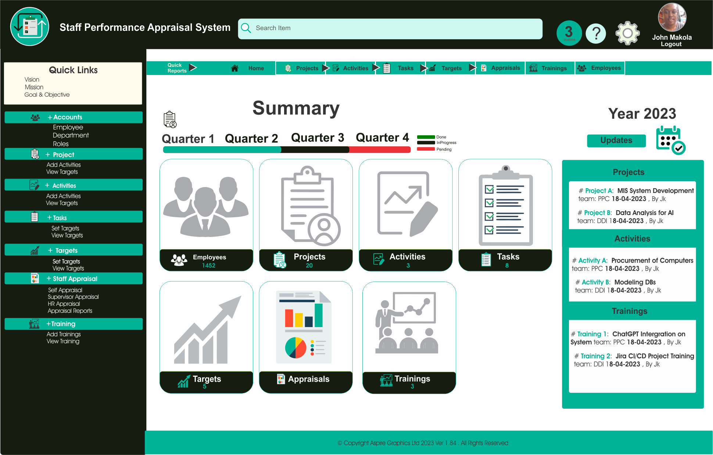

# Staff Performance Appraisal System Front End

The Staff Performance Appraisal System (SPAS) is a system of integrating employee participation through work planning, target setting and execution, evaluation, feedback and reporting.

The System enables an Appraisee and a Supervisor set Specific Measurable Achievable Realistic Time-bound (SMART) targets aligned to the Departmental/Directorate/Division/Section/Unit objectives as indicated in the Annual Work plan. This is The Front of the System
